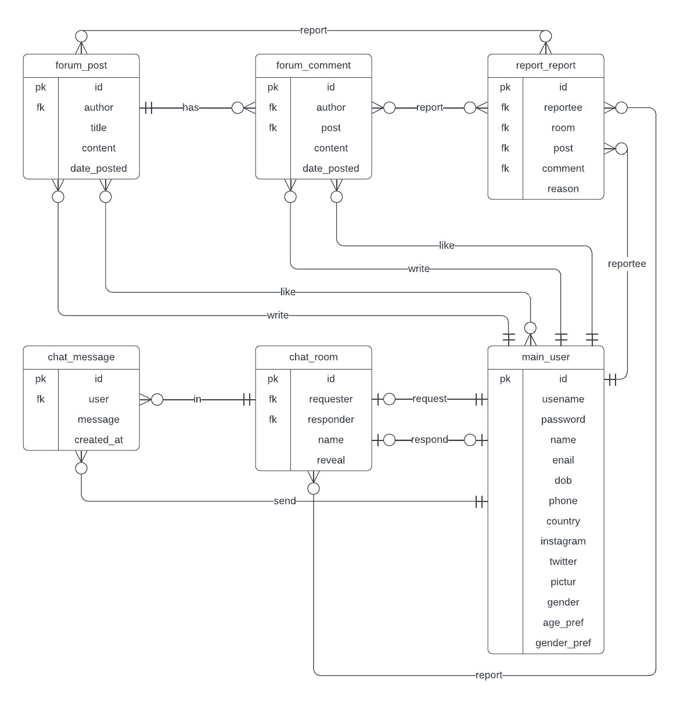
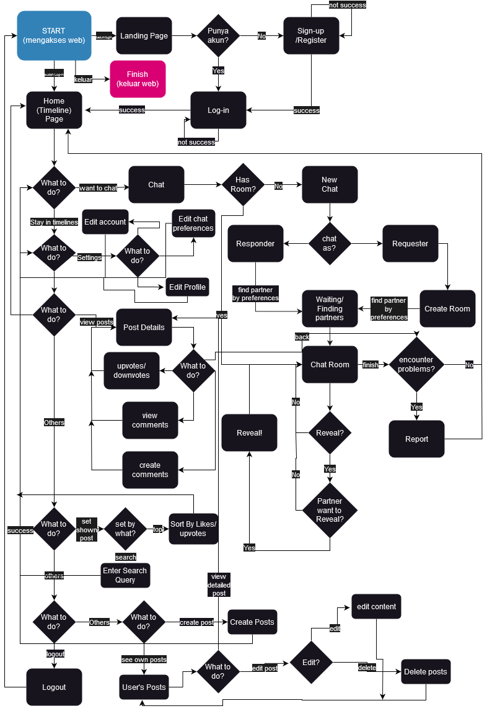

# Arcanon

|Name|NIM|
|--|--|
|[Ismy Fana FIllah](https://github.com/ismyfanafillah173)|G6401211001 |
|[Irfan Alamsyah](https://github.com/irfanalmsyah)|G6401211029|
|[Agustinus Zefanya](https://github.com/catashX)|G6401211092|

## Abstract
Mental health and social well-being have become crucial issues worldwide. Depression and other mental health problems affect individuals' self-confidence, making it difficult for them to share their stories and seek emotional support. Anonymity in social interactions through social media and websites can enhance someone's willingness to participate. So, the development of the Arcanon website aims to create an anonymous online platform that facilitates social interaction and story-sharing for individuals in need of support. Agile methods, particularly a combination of Scrum and Kanban, are used in this project's development to address changes with flexibility. The development process involves communication, planning, modeling, construction, and deployment. The result is the Arcanon website application with posting and chat features that implement CRUD, enabling social interaction and mental health support. Despite some differences between the prototype design and the final application, the website application includes the main planned features. The Kanban method helps organize discussions and visually monitor project progress. By adopting this method, the project can run efficiently and meet the set targets. The development of the Arcanon software is expected to improve mental health, facilitate positive social interactions, and enhance the overall quality of life for individuals and society as a whole.

## Development
### Entity Relationship Diagram


### Flowchart


## Installation
### Prerequisites
- [Docker](https://docs.docker.com/get-docker/)

### Steps
1. Clone this repository
```bash
git clone https://github.com/irfanalmsyah/arcanon.git
```
2. Run Docker Compose in the repository root directory
```bash
docker-compose up
```
3. Open `localhost` in your browser

## Tech Stack
- [Django](https://www.djangoproject.com/)
- [Daphne](https://github.com/django/daphne)
- [Channels](https://channels.readthedocs.io/)
- [Bootstrap](https://getbootstrap.com/)
- [PostgreSQL](https://www.postgresql.org/)
- [Docker](https://www.docker.com/)
